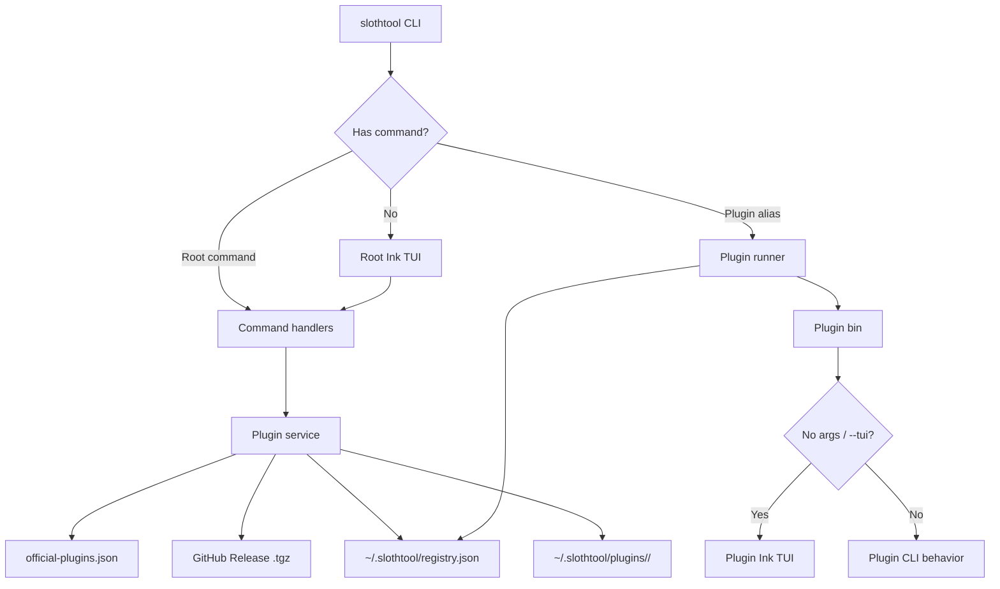

# SlothTool

SlothTool 是一个 TUI-first 的插件管理器：日常使用默认进入 Ink 全屏界面，同时保留可脚本化的 CLI 命令。

根包通过 npm 分发，官方插件通过 GitHub Release `.tgz` 资产安装到本机用户目录。当前内置官方插件为 `loc`、`image-compress`、`gstore` 和 `todo`。

```bash
npm install -g @holic512/slothtool
slothtool
```

## Overview

SlothTool 把“插件管理器”作为默认交互入口：根命令负责安装、更新、卸载和调度插件；插件自身继续保留独立命令与 TUI。这样日常操作可以在全屏界面完成，自动化脚本仍然可以直接调用稳定的 CLI。

## Features

| 能力 | 说明 |
| --- | --- |
| 默认 TUI | `slothtool` 无参数启动根管理器全屏 TUI。 |
| CLI 兼容 | `install`、`list`、`update`、`config`、`run`、`self-update` 等命令可直接脚本化调用。 |
| 官方插件分发 | 内置官方插件清单，安装源限定为 GitHub Release 资产。 |
| 平台资产选择 | `image-compress` 按当前系统和 CPU 架构选择匹配的预编译后端资产。 |
| 数据同步 | `gstore` 可把 `~/.slothtool/data` 绑定到 GitHub private repo，并同步插件配置和项目数据。 |
| TodoList | `todo` 将任务拆成独立 JSON 文件，并通过 `gstore` 手动同步。 |
| 双语界面 | 根管理器和官方插件支持中文 / English 文案。 |
| 本地用户数据 | 设置、注册表、插件包、插件配置和同步数据都保存在 `~/.slothtool/`。 |

## Requirements

- Node.js `>=22.0.0`
- npm `>=10`

## Install

```bash
npm install -g @holic512/slothtool
```

验证入口：

```bash
slothtool --help
slothtool
```

## Quick Start

启动根 TUI：

```bash
slothtool
```

安装并运行官方插件：

```bash
slothtool install loc
slothtool install image-compress
slothtool install gstore
slothtool install todo

slothtool loc
slothtool image-compress
slothtool gstore
slothtool todo
```

使用显式 CLI：

```bash
slothtool loc ./src
slothtool loc -v ./src

slothtool image-compress ./photo.jpg --dry-run
slothtool image-compress -r ./album --output-dir ./compressed

slothtool gstore repo set holic512/my-private-data --create
slothtool gstore bind todo default ~/.slothtool/data/todo/default
slothtool gstore sync todo default

slothtool todo add "Buy milk" --tag home --due today
slothtool todo list --due today
slothtool todo sync
```

## TUI Pages

根 TUI 的页面模型固定为：

| 页面 | 主要职责 |
| --- | --- |
| Home | 展示管理器入口信息与当前导航提示。 |
| Run | 选择已安装插件并启动插件 TUI 或 CLI 能力。 |
| Install | 从内置官方插件清单安装插件。 |
| Update | 先检查可更新项，再执行更新。 |
| Uninstall | 卸载已安装插件。 |
| Settings | 切换语言、代理与 GitHub 源配置。 |

从根 TUI 启动插件后，插件退出会返回根 TUI，并恢复离开前的页面与选择位置。

## Commands

| 命令 | 用途 |
| --- | --- |
| `slothtool` | 启动根全屏 TUI。 |
| `slothtool tui` | 显式启动根全屏 TUI。 |
| `slothtool install <alias>` | 安装内置官方插件。 |
| `slothtool uninstall <alias>` | 卸载指定插件。 |
| `slothtool update <alias>` | 更新指定插件。 |
| `slothtool --update-all` | 更新全部可更新目标。 |
| `slothtool list` | 查看已安装插件。 |
| `slothtool run <plugin> [args]` | 运行指定插件。 |
| `slothtool <plugin> [args]` | 插件简写运行方式。 |
| `slothtool config <...>` | 管理语言、代理和 GitHub 源。 |
| `slothtool self-update` | 更新根管理器包。 |
| `slothtool --uninstall-all` | 删除 SlothTool 用户数据与已安装插件。 |

## Official Plugins

| Alias | Package | 能力 | 入口 |
| --- | --- | --- | --- |
| `loc` | `@holic512/plugin-loc` | 统计目录代码行数、文件类型过滤、排除目录配置、详细模式。 | `slothtool loc` / `loc` |
| `image-compress` | `@holic512/plugin-image-compress` | JPEG / PNG 图片压缩、目录批处理、拖拽路径 TUI、多平台 Go 后端资产。 | `slothtool image-compress` / `image-compress` |
| `gstore` | `@holic512/plugin-gstore` | GitHub CLI 登录、私有仓库绑定、数据同步、冲突检测、手动同步 TUI。 | `slothtool gstore` / `gstore` |
| `todo` | `@holic512/plugin-todo` | 独立 JSON 任务文件、完整任务字段、列表、标签、手动 gstore 同步、默认 TUI。 | `slothtool todo` / `todo` |

### `loc`

```bash
slothtool install loc

slothtool loc
slothtool loc .
slothtool loc -v ./src

loc config show
loc config ext md off
loc config exclude dist on
loc config reset
```

### `image-compress`

```bash
slothtool install image-compress

slothtool image-compress
slothtool image-compress ./photo.jpg
slothtool image-compress ./photo.jpg --dry-run --json
slothtool image-compress -r ./album --output-dir ./compressed
```

常用压缩参数包括 `--quality`、`--max-width`、`--max-height`、`--overwrite`、`--allow-larger`、`--concurrency`、`--dry-run`、`--json` 和 `--quiet`。

### `gstore`

```bash
slothtool install gstore

slothtool gstore
slothtool gstore auth
slothtool gstore repo set holic512/my-private-data --create
slothtool gstore bind todo default ~/.slothtool/data/todo/default
slothtool gstore status todo default
slothtool gstore pull todo default
slothtool gstore push todo default -m "sync todo"
slothtool gstore sync todo default
slothtool gstore conflicts todo default --json
```

`gstore` 固定使用 `~/.slothtool/data` 作为本地 Git 工作区。它只调用本机 `git` 和 GitHub CLI `gh`，不保存 GitHub token。同一文件在本地和远端都发生变化时，v1 会停止同步并报告冲突文件。

### `todo`

```bash
slothtool install todo

slothtool todo
slothtool todo add "Buy milk" --tag home --due today
slothtool todo list --status todo --sort due
slothtool todo show <id-prefix>
slothtool todo edit <id-prefix> --priority high --project personal
slothtool todo checklist add <id-prefix> "Prepare receipt"
slothtool todo note add <id-prefix> "Remember coupon"
slothtool todo done <id-prefix>
slothtool todo sync
```

`todo` 固定把数据写入 `~/.slothtool/data/todo/default/`。任务文件按 `tasks/<yyyy>/<mm>/<uuid>.json` 拆分，列表写入 `lists/<id>.json`，插件配置写入 `~/.slothtool/data/plugin-configs/todo.json`。同步命令依赖已安装并已绑定的 `gstore`：

```bash
slothtool install gstore
slothtool gstore bind todo default ~/.slothtool/data/todo/default
slothtool todo sync
```

## Configuration

全局设置默认保存在 `~/.slothtool/settings.json`：

```json
{
  "language": "zh",
  "network": {
    "proxy": {
      "enabled": false,
      "protocol": "http",
      "host": "127.0.0.1",
      "port": 7980,
      "noProxy": "localhost,127.0.0.1,::1"
    },
    "github": {
      "preset": "gh-proxy",
      "customBaseUrl": ""
    }
  }
}
```

常用配置命令：

| 命令 | 说明 |
| --- | --- |
| `slothtool config` | 查看语言、代理和 GitHub 源摘要。 |
| `slothtool config language zh` | 切换为中文。 |
| `slothtool config language en` | 切换为 English。 |
| `slothtool config proxy show` | 查看网络配置。 |
| `slothtool config proxy enabled on` | 启用代理。 |
| `slothtool config proxy enabled off` | 关闭代理。 |
| `slothtool config proxy host 127.0.0.1` | 设置代理主机。 |
| `slothtool config proxy port 7890` | 设置代理端口。 |
| `slothtool config proxy github official` | 使用官方 GitHub 源。 |
| `slothtool config proxy github gh-proxy` | 使用内置 GitHub 代理预设。 |
| `slothtool config proxy github-url https://proxy.example.com` | 写入自定义 GitHub 代理地址，并切换到 `custom`。 |

## Architecture



安装流程：

1. `slothtool install <alias>` 从 `lib/official-plugins.json` 查找内置官方插件。
2. SlothTool 根据插件策略、当前系统平台和 CPU 架构选择 GitHub Release `.tgz` 资产。
3. 资产被解包并部署到 `~/.slothtool/plugins/<alias>/`。
4. 插件入口、版本和来源信息写入 `~/.slothtool/registry.json`。
5. `slothtool <plugin>` 从注册表解析插件入口；无额外参数时优先进入插件默认 TUI。

## Data Layout

```text
~/.slothtool/
├── settings.json
├── registry.json
├── data/
│   ├── .git/
│   ├── plugin-configs/
│   │   ├── loc.json
│   │   └── todo.json
│   └── todo/
│       └── default/
│           ├── lists/
│           │   └── default.json
│           └── tasks/
│               └── <yyyy>/<mm>/<uuid>.json
├── plugins/
│   ├── image-compress/
│   ├── gstore/
│   ├── loc/
│   └── todo/
└── plugin-configs/
    └── gstore.json
```

## Repository Layout

```text
SlothTool/
├── bin/                     Root CLI entry
├── lib/                     Root commands, services, settings, i18n, and TUI
├── plugins/
│   ├── loc/                 Official LOC plugin workspace
│   ├── image-compress/      Official image compression plugin workspace
│   ├── gstore/              Official GitHub data sync plugin workspace
│   ├── todo/                Official JSON TodoList plugin workspace
│   └── template-basic/      Plugin scaffold template
├── test/                    node:test regression suite
├── PLUGIN_DEVELOPMENT.md    Plugin contract and development notes
├── LOCAL_BUILD_GUIDE.md     Local build and release validation notes
└── package.json
```

## Development

```bash
npm install
npm link

node bin/slothtool.js --help
node plugins/loc/bin/loc.js --help
node plugins/image-compress/bin/image-compress.js --help
node plugins/gstore/bin/gstore.js --help
node plugins/todo/bin/todo.js --help
```

Focused checks:

```bash
node --check bin/slothtool.js
node --check lib/tui/root-tui.js
SLOTHTOOL_TUI_TEST_ACTION=exit node bin/slothtool.js
SLOTHTOOL_LOC_TUI_TEST_ACTION=exit node plugins/loc/bin/loc.js
SLOTHTOOL_IMAGE_COMPRESS_TUI_TEST_ACTION=exit node plugins/image-compress/bin/image-compress.js
SLOTHTOOL_GSTORE_TUI_TEST_ACTION=exit node plugins/gstore/bin/gstore.js
SLOTHTOOL_TODO_TUI_TEST_ACTION=exit node plugins/todo/bin/todo.js
```

Full regression:

```bash
npm test
```

More project docs:

- [Plugin development](./PLUGIN_DEVELOPMENT.md)
- [Local build guide](./LOCAL_BUILD_GUIDE.md)

## License

ISC, as declared in [package.json](./package.json). This repository does not currently include a standalone `LICENSE` file.
