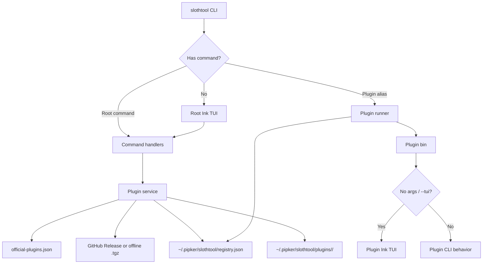

# SlothTool

SlothTool 是一个 TUI-first 的插件管理器：日常使用默认进入 Ink 全屏界面，同时保留可脚本化的 CLI 命令。

根包通过 npm 分发，官方插件通过 GitHub Release `.tgz` 资产安装到本机用户目录。当前内置官方插件为 `loc`、`image-compress`、`gstore`、`codex-models`、`pzip` 和 `slothvault`。

```bash
npm install -g @holic512/slothtool
slothtool
```

## Overview

SlothTool 把“插件管理器”作为默认交互入口：根命令负责安装、更新、卸载和调度插件；插件自身继续保留独立命令与 TUI。这样日常操作可以在全屏界面完成，自动化脚本仍然可以直接调用稳定的 CLI。

## Features

| 能力 | 说明 |
| --- | --- |
| 默认 TUI | `slothtool` 无参数启动根管理器全屏 TUI。 |
| CLI 兼容 | `install`、`list`、`update`、`config`、`run`、`self-update` 等命令可直接脚本化调用。 |
| 官方插件分发 | 内置官方插件清单，支持 GitHub Release 在线安装与经过包名校验的离线 `.tgz` 安装。 |
| 离线归档 | `slothtool bundle` 可把已安装且运行时依赖完整的官方插件打包为可迁移归档。 |
| 平台资产选择 | `image-compress` 按当前系统和 CPU 架构选择匹配的预编译后端资产。 |
| 配置云同步 | `gstore` 通过独立 Git 仓库缓存同步全局设置、插件配置和数据，并提供冲突检测与显式覆盖策略。 |
| Codex 模型管理 | `codex-models` 诊断自定义 provider，同步跨厂商模型库、上下文与推理等级，并生成 Desktop 离线修复脚本。 |
| 项目 ZIP 压缩 | `pzip` 递归创建 ZIP，默认过滤 macOS、构建产物与 Git 元数据，并应用嵌套 `.gitignore`。 |
| SlothVault 多功能包 | `slothvault` 提供 Linux 部署、Codex/Claude Code Skill 管理与独立 MCP 命令注册；注册后的 `slothvault-mcp` 动态发现管理员 MCP 能力并执行带风险确认的调用。 |
| 双语界面 | 根管理器和官方插件支持中文 / English 文案。 |
| 本地用户数据 | 设置、注册表、插件包、插件配置和同步数据都保存在 `~/.pipker/slothtool/`。 |

## Requirements

- Node.js `>=22.0.0`
- npm `>=10`

## Install

```bash
npm install -g @holic512/slothtool
```

验证入口：

```bash
slothtool --help
slothtool
```

## Quick Start

启动根 TUI：

```bash
slothtool
```

安装并运行官方插件：

```bash
slothtool install loc
slothtool install image-compress
slothtool install gstore
slothtool install codex-models
slothtool install pzip
slothtool install slothvault

slothtool loc
slothtool image-compress
slothtool gstore
slothtool codex-models
slothtool pzip
slothtool slothvault
```

使用显式 CLI：

```bash
slothtool loc ./src
slothtool loc -v ./src

slothtool image-compress ./photo.jpg --dry-run
slothtool image-compress -r ./album --output-dir ./compressed

slothtool gstore repo set holic512/my-private-data --create
slothtool gstore status
slothtool gstore sync

slothtool codex-models doctor
slothtool codex-models library show gpt-5.6-sol
slothtool codex-models model set gpt-5.6-sol --reasoning ultra

slothtool pzip ./my-project
slothtool pzip ./my-project --exclude "logs/" --dry-run

slothtool slothvault mcp register
slothvault-mcp profile add intranet --url http://vault.internal --default
slothvault-mcp doctor
slothvault-mcp tools list
```

## TUI Pages

根 TUI 的页面模型固定为：

| 页面 | 主要职责 |
| --- | --- |
| Home | 展示管理器入口信息与当前导航提示。 |
| Run | 浏览已安装插件的版本、来源和能力，并启动插件 TUI 或 CLI 能力。 |
| Install | 浏览内置官方插件的说明和能力，再执行安装。 |
| Update | 先检查可更新项，再对照状态、当前版本和最新版本执行单项或批量更新。 |
| Uninstall | 对照插件信息与移除范围卸载插件，并单独标记全量数据清理风险。 |
| Settings | 对照当前值与执行后值，切换语言、代理与 GitHub 源配置。 |

除 Home 外，管理页面在宽终端使用“左侧选择、右侧详情”的双栏布局，在窄终端自动合并为单面板，避免额外提示框占用主内容空间。

Run 页面会把最近运行的插件排在前面，未运行过的插件继续按别名稳定排序。插件退出后会返回根 TUI，并聚焦刚刚运行、已经移动到列表首位的插件。

## Commands

| 命令 | 用途 |
| --- | --- |
| `slothtool` | 启动根全屏 TUI。 |
| `slothtool tui` | 显式启动根全屏 TUI。 |
| `slothtool install <alias>` | 从 GitHub Release 安装内置官方插件。 |
| `slothtool install <alias> --file <archive.tgz>` | 从经过 alias 与包名校验的本地归档离线安装官方插件。 |
| `slothtool bundle <alias> [--output <archive.tgz>]` | 将已安装官方插件和已有运行时依赖打包为离线归档。 |
| `slothtool uninstall <alias>` | 卸载指定插件。 |
| `slothtool update <alias>` | 更新指定插件。 |
| `slothtool --update-all` | 更新全部可更新目标。 |
| `slothtool list` | 查看已安装插件。 |
| `slothtool run <plugin> [args]` | 运行指定插件。 |
| `slothtool <plugin> [args]` | 插件简写运行方式。 |
| `slothtool config <...>` | 管理语言、代理和 GitHub 源。 |
| `slothtool self-update` | 更新根管理器包。 |
| `slothtool --uninstall-all` | 删除 SlothTool 用户数据与已安装插件。 |

## Official Plugins

| Alias | Package | 能力 | 入口 |
| --- | --- | --- | --- |
| `loc` | `@holic512/plugin-loc` | 统计目录代码行数、文件类型过滤、排除目录配置、详细模式。 | `slothtool loc` / `loc` |
| `image-compress` | `@holic512/plugin-image-compress` | JPEG / PNG 图片压缩、目录批处理、拖拽路径 TUI、多平台 Go 后端资产。 | `slothtool image-compress` / `image-compress` |
| `gstore` | `@holic512/plugin-gstore` | GitHub CLI 登录、独立 Git 缓存、设置/插件配置/数据全量同步、冲突检测和显式覆盖策略。 | `slothtool gstore` / `gstore` |
| `codex-models` | `@holic512/plugin-codex-models` | 自定义 provider 诊断、跨厂商模型库、上下文和推理等级切换、目录同步、Desktop 离线修复脚本。 | `slothtool codex-models` / `codex-models` |
| `pzip` | `@holic512/plugin-pzip` | ZIP 目录压缩、递归过滤 `.DS_Store`/`__MACOSX`/`dist`/`target`/`.git`、嵌套 `.gitignore` 与规则配置。 | `slothtool pzip` / `pzip` |
| `slothvault` | `@holic512/plugin-slothvault` | Linux 部署、Skill 管理、独立 MCP 命令注册，以及动态发现管理员 MCP Tool、Prompt 和 Resource。 | `slothtool slothvault` / 注册后的 `slothvault-mcp` |

### `loc`

```bash
slothtool install loc

slothtool loc
slothtool loc .
slothtool loc -v ./src

loc config show
loc config ext md off
loc config exclude dist on
loc config reset
```

`loc` TUI 会根据终端宽高在双栏、上下堆叠和低高度单面板之间切换。统计结果优先展示文件数、总行数、扩展名分布与热点文件；扩展名和排除目录页面则展示当前规则状态、匹配范围与动态分页列表。

### `pzip`

```bash
slothtool install pzip

slothtool pzip
slothtool pzip ./my-project
slothtool pzip ./my-project --output ./releases/my-project
slothtool pzip ./my-project --exclude "logs/" --exclude "*.log" --dry-run
pzip config rule target off
pzip config add "reports/"
```

`pzip` 默认把目录递归写入 ZIP，并将源目录名作为压缩包最外层目录。任意层级中的 `.DS_Store`、`__MACOSX`、`dist`、Java 构建 `target` 和 `.git` 默认过滤；根目录和每个子目录中的 `.gitignore` 都会按各自相对路径生效。启用的默认规则优先于 `.gitignore` 的否定规则。配置保存在 `~/.pipker/slothtool/plugin-configs/pzip.json`，同名 ZIP 会自动改用时间戳文件名，避免覆盖已有归档。

### `image-compress`

```bash
slothtool install image-compress

slothtool image-compress
slothtool image-compress ./photo.jpg
slothtool image-compress ./photo.jpg --dry-run --json
slothtool image-compress -r ./album --output-dir ./compressed
```

常用压缩参数包括 `--quality`、`--max-width`、`--max-height`、`--overwrite`、`--allow-larger`、`--concurrency`、`--dry-run`、`--json` 和 `--quiet`。

`image-compress` TUI 围绕输入队列、执行方案、压缩收益和异常文件组织任务。宽终端使用操作侧栏与输入/结果主区，窄终端按工作流纵向排列，低高度终端自动收起次要结果；选项页会按高度分页并解释当前参数的实际影响。

### `gstore`

```bash
slothtool install gstore

slothtool gstore
slothtool gstore auth
slothtool gstore repo set holic512/my-private-data --create
slothtool gstore status
slothtool gstore pull
slothtool gstore push -m "sync SlothTool configuration"
slothtool gstore sync
slothtool gstore conflicts --json
```

`gstore` 使用 `~/.pipker/slothtool/cache/gstore/repository` 作为独立 Git 工作区，不会在实际数据目录中创建 `.git`。默认同步三个系统范围：`settings.json`、`plugin-configs/`（排除保存远端地址和同步基线的 `gstore.json`）以及 `data/`；`registry.json`、已安装插件和缓存不会跨设备同步。需要附加其他工具目录时，可继续使用 `gstore bind <tool> <name> <localDir>`。

它只调用本机 `git` 和 GitHub CLI `gh`，不保存 GitHub token。默认遇到同文件双向修改会停止；确认取舍后使用 `gstore sync --prefer-remote` 或 `gstore sync --prefer-local` 显式解决。新设备已有默认设置文件时，首次恢复使用 `gstore pull --prefer-remote`。TUI 对覆盖动作提供二次确认。

### `codex-models`

```bash
slothtool install codex-models

slothtool codex-models
slothtool codex-models doctor
slothtool codex-models catalog sync
slothtool codex-models library list
slothtool codex-models library show gpt-5.6-sol
slothtool codex-models model set gpt-5.6-sol --reasoning max
slothtool codex-models reasoning set ultra
slothtool codex-models repair create gpt-5.6-sol
```

`codex-models` 会优先采用 provider `/models` 返回的显式能力，再合并 OpenAI、Claude、Gemini、Grok、DeepSeek、Qwen、Mistral、Kimi、GLM、MiniMax、Llama、Hunyuan、Baichuan、InternLM、Nemotron、Jamba、Granite、Sonar 等常见厂商兼容画像。模型详情包含上下文窗口、推理等级、默认推理等级、输入模态、联网搜索和并行工具能力；未知模型保守回退为 `low / medium / high`。`gpt-5.6-sol` 的 provider 扩展画像包含 `max` 和 `ultra`。

Desktop 修复命令只生成一次性脚本。必须完全退出 Codex 后在独立 Terminal 执行；脚本先检查 LevelDB 锁并完整备份，不修改 `app.asar`、不使用 `launchctl`、不修改 `default_model`。启用缓存冻结可减少 Statsig 立即覆盖，但会暂时冻结同一缓存身份的其他动态配置更新，详细回滚方法见 [`plugins/codex-models/README.md`](./plugins/codex-models/README.md)。

### `slothvault`

```bash
slothtool install slothvault
slothtool slothvault mcp register

slothtool slothvault
slothtool slothvault deploy
slothtool slothvault skill status
slothtool slothvault mcp status
slothvault-mcp profile add production --url https://vault.example.com --default
slothvault-mcp doctor --profile production
slothvault-mcp tools list --profile production
slothvault-mcp tools show TOOL_NAME --profile production
slothvault-mcp tools call TOOL_NAME --args '{}' --profile production --yes --json
slothvault-mcp prompts list --profile production
slothvault-mcp prompts get PROMPT_NAME --args '{}' --profile production
slothvault-mcp resources list --profile production
slothvault-mcp resources read RESOURCE_URI --output ./artifact.bin --profile production
slothvault-mcp history list
slothvault-mcp storage status --json
```

多功能入口包括 `deploy`、`skill status|install|uninstall` 与 `mcp status|register|unregister`。它不会转发 `profile`、`doctor`、Tool、Prompt、Resource、History 或 Storage 参数；这些 MCP 调用会明确提示改用已注册的独立命令。独立 `slothvault-mcp` 命令组包括 `profile add|update|list|show|use|remove`、`doctor`、`tools list|show|call`、`prompts list|get`、`resources list|read`、`history list|show|clear` 与只读的 `storage status`。JSON 参数可由 `--args` 或 `--args-file <path|->` 提供；凭据只通过隐藏输入、`--key-stdin` 或 `--key-env` 接收，不提供会泄漏到进程参数和 shell 历史中的 `--key`。

旧的 `slothtool slothvault-mcp …` 仍是带迁移提示的兼容入口：普通 MCP 参数会转发给独立 `slothvault-mcp` executable，而旧 `skill …` 参数会转发给 `slothtool slothvault skill …`。新脚本应只使用规范的 `slothvault` 插件别名和已注册的独立 MCP 命令。

`--json` 成功时只输出一个 JSON 文档，警告写入 stderr。稳定退出码为：`0` 成功、`2` 用法/配置/缺少确认、`3` 认证失败、`4` 网络/超时/服务或协议失败、`5` MCP 业务失败、`1` 其他内部错误。

插件通过 MCP 初始化与实时发现读取 SlothVault 暴露的 Tool、Prompt 和 Resource Template，不在客户端硬编码业务清单。只有 `annotations.readOnlyHint === true` 的 Tool 会被视为只读；其他 Tool 在交互终端执行前要求确认，在非 TTY、`--json` 或 stdin 参数模式下必须显式传入 `--yes`。Prompt 只获取并展示 MCP messages，不自动执行其中描述的 Tool。MCP TUI 可查看连接状态、能力与脱敏历史，并在“配置”页管理本地 Profile；它不执行 Tool、获取 Prompt 内容或读取 Resource。Skill 只通过 `slothtool slothvault skill …` 管理。

发行包内置 `slothvault-mcp` Skill。通过 `slothtool slothvault skill install` 会检测 Codex 与 Claude Code，并只在已检测智能体自己的目录创建链接：Codex 使用 `$CODEX_HOME/skills/slothvault-mcp`（默认 `~/.codex/skills/slothvault-mcp`），Claude Code 使用 `$CLAUDE_CONFIG_DIR/skills/slothvault-mcp`（默认 `~/.claude/skills/slothvault-mcp`）；不再向 `~/.agents/skills` 新装链接。若任一目标存在其他内容，交互模式会列出冲突路径并询问是否永久删除且不备份，非交互或 `--json` 模式只有显式 `--yes` 才能覆盖；卸载只删除准确指向当前插件 Skill 的受管链接。未出现 Skill 时请重启对应智能体。

TUI 的 Profile 表单不会载入现有明文 Key，也不会显示本次输入的新 Key；编辑时 Key 留空会保留原值。配置变更不会自动连接服务端，默认 Profile 或连接参数变化后需按 `r` 重新发现能力。

配置保存在 `~/.pipker/slothtool/plugin-configs/slothvault.json`，其中 Bearer Key 为明文；历史保存在 `~/.pipker/slothtool/data/slothvault/history.json`，只记录脱敏摘要，不保存完整参数、完整结果或 Resource 内容。首次使用时，旧 MCP-only 路径只会在新位置不存在时原子迁移；两者同时存在时绝不覆盖或合并。`slothvault-mcp storage status --json` 只报告各路径状态，不读取或打印任何 Key、Profile 或历史正文。若根命令输出 `SLOTHVAULT_PLUGIN_UPGRADE_REQUIRED`，说明旧 MCP-only 包仍处于规范别名下；先执行 `slothtool update slothvault`，重新注册 `slothvault-mcp`，再使用独立命令配置或诊断。`gstore` 默认会同步 `plugin-configs/` 和 `data/`，因此其私有同步仓库可能包含明文 Key 与脱敏历史元数据。优先使用 HTTPS；HTTP endpoint 可以用于受控内网，但插件会持续显示明文传输警告。

读取 Resource 时必须显式指定 `--output`，目标文件已存在则拒绝覆盖。插件只接受 SlothVault 受保护的 Resource URI，校验 MIME、Base64、大小及 `_meta["slothvault/file-name"]` 文件名后再原子落盘，并兼容旧服务端的顶层 `name` 字段；托管文件上限为 10 MiB，合同附件上限为 25 MiB，Resource Base64 不会打印到终端。

需要管理员权限管理 `/data`、Nginx 或 Certbot 时，使用 `sudo env HOME="$HOME" "$(command -v slothtool)" slothvault deploy …`，以保留安装用户的 SlothTool 数据目录。注册独立 MCP 命令时不会覆盖同名用户命令；非交互替换需要 `--replace --yes`。卸载插件前应先执行 `slothtool slothvault skill uninstall`。`slothtool uninstall slothvault` 会删除插件包和 profile 配置，但不会自动删除用户级 Skill 链接，并会保留脱敏历史；需要删除历史时先执行 `slothvault-mcp history clear --yes`。

## Offline Plugin Archives

从本地归档安装仍只允许内置官方 alias，并会校验归档内 `package.json` 的包名：

```bash
slothtool install codex-models --file ./codex-models-offline.tgz
```

在已安装插件且运行时依赖完整的机器上创建自包含归档：

```bash
slothtool bundle codex-models --output ./codex-models-offline.tgz
```

离线归档使用 `package/` 根布局。若归档没有 `node_modules` 但声明了依赖，安装器只会尝试 `npm install --omit=dev --offline`；npm 缓存不完整时会失败并提示先在联网机器上执行 `slothtool bundle`。

## Configuration

全局设置默认保存在 `~/.pipker/slothtool/settings.json`：

```json
{
  "language": "zh",
  "network": {
    "proxy": {
      "enabled": false,
      "protocol": "http",
      "host": "127.0.0.1",
      "port": 7980,
      "noProxy": "localhost,127.0.0.1,::1"
    },
    "github": {
      "preset": "gh-proxy",
      "customBaseUrl": ""
    }
  }
}
```

常用配置命令：

| 命令 | 说明 |
| --- | --- |
| `slothtool config` | 查看语言、代理和 GitHub 源摘要。 |
| `slothtool config language zh` | 切换为中文。 |
| `slothtool config language en` | 切换为 English。 |
| `slothtool config proxy show` | 查看网络配置。 |
| `slothtool config proxy enabled on` | 启用代理。 |
| `slothtool config proxy enabled off` | 关闭代理。 |
| `slothtool config proxy host 127.0.0.1` | 设置代理主机。 |
| `slothtool config proxy port 7890` | 设置代理端口。 |
| `slothtool config proxy github official` | 使用官方 GitHub 源。 |
| `slothtool config proxy github gh-proxy` | 使用内置 GitHub 代理预设。 |
| `slothtool config proxy github-url https://proxy.example.com` | 写入自定义 GitHub 代理地址，并切换到 `custom`。 |

## Architecture


```mermaid
flowchart TD
    A["slothtool CLI"] --> B{"Has command?"}
    B -- "No" --> C["Root Ink TUI"]
    B -- "Root command" --> D["Command handlers"]
    B -- "Plugin alias" --> E["Plugin runner"]
    C --> D
    D --> F["Plugin service"]
    F --> G["official-plugins.json"]
    F --> H["GitHub Release or offline .tgz"]
    F --> I["~/.pipker/slothtool/registry.json"]
    F --> J["~/.pipker/slothtool/plugins/<alias>/"]
    E --> I
    E --> K["Plugin bin"]
    K --> L{"No args / --tui?"}
    L -- "Yes" --> M["Plugin Ink TUI"]
    L -- "No" --> N["Plugin CLI behavior"]
```

安装流程：

1. `slothtool install <alias>` 或 `install <alias> --file <archive.tgz>` 从 `lib/official-plugins.json` 查找内置官方插件。
2. 在线安装按插件策略、当前平台和 CPU 架构选择 GitHub Release `.tgz`；离线安装校验本地归档包名。
3. 资产被解包并部署到 `~/.pipker/slothtool/plugins/<alias>/`；缺少运行时依赖时只允许使用 npm 离线缓存补齐。
4. 插件入口、版本和来源类型写入 `~/.pipker/slothtool/registry.json`。
5. `slothtool <plugin>` 从注册表解析插件入口；无额外参数时优先进入插件默认 TUI。

## Data Layout

```text
~/.pipker/slothtool/
├── settings.json
├── registry.json
├── data/
│   ├── slothvault/
│   │   └── history.json
│   └── <plugin-data>/
├── cache/
│   └── gstore/
│       └── repository/
│           ├── .git/
│           └── system/
├── plugins/
│   ├── image-compress/
│   ├── gstore/
│   ├── loc/
│   └── slothvault/
└── plugin-configs/
    ├── gstore.json
    ├── slothvault.json
    └── <plugin-config>.json
```

SlothVault Skill 安装在 SlothTool 数据目录之外：已检测到 Codex 时链接到 `~/.codex/skills/slothvault-mcp`，已检测到 Claude Code 时链接到 `~/.claude/skills/slothvault-mcp`；两者均指向 `~/.pipker/slothtool/plugins/slothvault/skills/slothvault-mcp`。

## Repository Layout

```text
SlothTool/
├── bin/                     Root CLI entry
├── lib/                     Root commands, services, settings, i18n, and TUI
├── plugins/
│   ├── loc/                 Official LOC plugin workspace
│   ├── image-compress/      Official image compression plugin workspace
│   ├── gstore/              Official GitHub data sync plugin workspace
│   ├── codex-models/        Official Codex model configuration plugin workspace
│   ├── pzip/                Official filtered ZIP archive plugin workspace
│   ├── slothvault/          Official SlothVault multifunction plugin workspace
│   └── template-basic/      Plugin scaffold template
├── test/                    node:test regression suite
├── PLUGIN_DEVELOPMENT.md    Plugin contract and development notes
├── LOCAL_BUILD_GUIDE.md     Local build and release validation notes
└── package.json
```

## Development

```bash
npm install
npm link

node bin/slothtool.js --help
node plugins/loc/bin/loc.js --help
node plugins/image-compress/bin/image-compress.js --help
node plugins/gstore/bin/gstore.js --help
node plugins/codex-models/bin/codex-models.js --help
node plugins/pzip/bin/pzip.js --help
node plugins/slothvault/bin/slothvault.js --help
node plugins/slothvault/bin/slothvault-mcp.js --help
```

Focused checks:

```bash
node --check bin/slothtool.js
node --check lib/tui/root-tui.js
SLOTHTOOL_TUI_TEST_ACTION=exit node bin/slothtool.js
SLOTHTOOL_LOC_TUI_TEST_ACTION=exit node plugins/loc/bin/loc.js
SLOTHTOOL_IMAGE_COMPRESS_TUI_TEST_ACTION=exit node plugins/image-compress/bin/image-compress.js
SLOTHTOOL_GSTORE_TUI_TEST_ACTION=exit node plugins/gstore/bin/gstore.js
SLOTHTOOL_CODEX_MODELS_TUI_TEST_ACTION=exit node plugins/codex-models/bin/codex-models.js
SLOTHTOOL_PZIP_TUI_TEST_ACTION=exit node plugins/pzip/bin/pzip.js
SLOTHTOOL_SLOTHVAULT_TUI_TEST_ACTION=exit node plugins/slothvault/bin/slothvault.js
SLOTHTOOL_SLOTHVAULT_MCP_TUI_TEST_ACTION=exit node plugins/slothvault/bin/slothvault-mcp.js
```

Full regression:

```bash
npm test
```

More project docs:

- [Plugin development](./PLUGIN_DEVELOPMENT.md)
- [Local build guide](./LOCAL_BUILD_GUIDE.md)

## License

ISC, as declared in [package.json](./package.json). This repository does not currently include a standalone `LICENSE` file.
