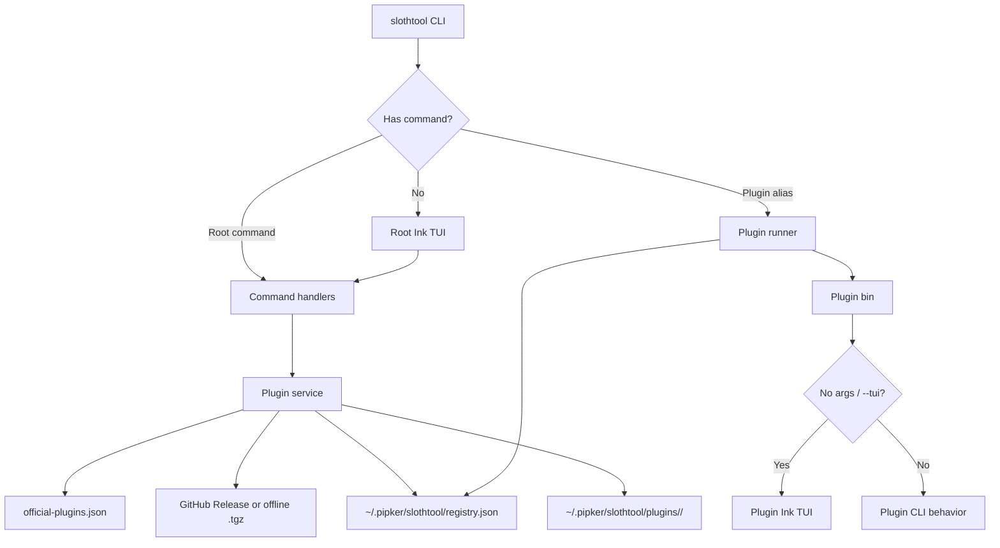

# SlothTool

SlothTool 是一个 TUI-first 的插件管理器：日常使用默认进入 Ink 全屏界面，同时保留可脚本化的 CLI 命令。

根包通过 npm 分发，官方插件通过 GitHub Release `.tgz` 资产安装到本机用户目录。当前内置官方插件为 `loc`、`image-compress`、`gstore`、`pzip` 和 `slothvault`。

```bash
npm install -g @holic512/slothtool
slothtool
```

## Overview

SlothTool 把“插件管理器”作为默认交互入口：根命令负责安装、更新、卸载和调度插件；插件自身继续保留独立命令与 TUI。这样日常操作可以在全屏界面完成，自动化脚本仍然可以直接调用稳定的 CLI。

## Features

| 能力 | 说明 |
| --- | --- |
| 默认 TUI | `slothtool` 无参数启动根管理器全屏 TUI。 |
| CLI 兼容 | `install`、`list`、`update`、`config`、`run`、`self-update` 等命令可直接脚本化调用。 |
| 官方插件分发 | 内置官方插件清单，支持 GitHub Release 在线安装与经过包名校验的离线 `.tgz` 安装。 |
| 离线归档 | `slothtool bundle` 可把已安装且运行时依赖完整的官方插件打包为可迁移归档。 |
| 平台资产选择 | `image-compress` 按当前系统和 CPU 架构选择匹配的预编译后端资产。 |
| 配置云同步 | `gstore` 通过独立 Git 仓库缓存同步全局设置、插件配置和数据，并提供冲突检测与显式覆盖策略。 |
| 项目 ZIP 压缩 | `pzip` 递归创建 ZIP，默认过滤 macOS、构建产物与 Git 元数据，并应用嵌套 `.gitignore`。 |
| SlothVault 管理界面 | `sv`/`slothvault` 独立管理 Deployment 和 Skill 包，展示部署状态与真实进度；Codex 等智能体通过原生 MCP 配置直连服务端。 |
| 双语界面 | 根管理器和官方插件支持中文 / English 文案。 |
| 本地用户数据 | 设置、注册表、插件包、插件配置和同步数据都保存在 `~/.pipker/slothtool/`。 |

## Requirements

- Node.js `>=22.0.0`
- npm `>=10`

## Install

```bash
npm install -g @holic512/slothtool
```

验证入口：

```bash
slothtool --help
slothtool
```

## Quick Start

启动根 TUI：

```bash
slothtool
```

安装并运行官方插件：

```bash
slothtool install loc
slothtool install image-compress
slothtool install gstore
slothtool install pzip
slothtool install slothvault

slothtool loc
slothtool image-compress
slothtool gstore
slothtool pzip
slothtool sv
```

使用显式 CLI：

```bash
slothtool loc ./src
slothtool loc -v ./src

slothtool image-compress ./photo.jpg --dry-run
slothtool image-compress -r ./album --output-dir ./compressed

slothtool gstore repo set holic512/my-private-data --create
slothtool gstore status
slothtool gstore sync

slothtool pzip ./my-project
slothtool pzip ./my-project --exclude "logs/" --dry-run

slothtool sv deploy package install
slothtool sv skill install
slothtool sv skill status --check --json
```

## TUI Pages

根 TUI 的页面模型固定为：

| 页面 | 主要职责 |
| --- | --- |
| Home | 显示当前工作目录；有插件时快速启动最近使用的最多三个插件，无插件时直接进入官方安装目录。 |
| Run | 浏览已安装插件的版本、来源和能力，并启动插件 TUI 或 CLI 能力；空列表可按 Enter 前往安装页。 |
| Install | 浏览内置官方插件的说明和能力，安装成功后可按 Enter 立即启动该插件。 |
| Update | 先检查可更新项，再对照状态、当前版本和最新版本执行单项或批量更新。 |
| Uninstall | 对照插件信息与移除范围卸载插件，并单独标记全量数据清理风险。 |
| Settings | 对照当前值与待应用值，切换语言、代理及 GitHub 源；代理主机、任意有效端口和自定义下载源通过草稿编辑。 |

Home 恢复居中的青紫 Logo 和单次入场动画，下方保留当前目录、最近插件与安装快捷入口；低高度或窄窗口收起大型 Logo，并始终显示选中的入口。其余管理页面在宽终端使用“左侧选择、右侧详情”的双栏布局，在窄终端自动合并为单面板。列表、状态徽标和详情字段保留高对比配色，列表会按实际终端高度翻页并保持选中项可见；终端小于 44 列或 11 行时会提示扩大窗口。按 `v` 可翻阅选中项的完整说明、路径、来源与错误，使用方向键或 Page Up / Page Down 翻页，按 Esc 返回。

根管理器及官方插件可用 Tab / Shift+Tab 正反向切页；↑↓ 操作当前列表或详情，Space 切换开关，底栏说明 Enter 当前会执行的动作。Esc 先关闭正在编辑的表单、确认、帮助或详情，再返回页面。文本输入支持 ←→、Home/End、Backspace、Delete、Ctrl+U 和终端粘贴；长文本沿光标横向滚动，按 `v` 可查看当前页的完整路径、说明或错误。输入中的 `q`、`y` 和 Tab 由表单接管。状态符号与文字会在无颜色终端中保留。

底栏在空间足够时左侧显示状态、右侧显示按键；空间不足时自动分成两行，并相应减少内容区高度。任务经过准备、执行、成功、部分失败或失败阶段；结果不会因短暂计时自动清除。按 `f` 可回看本次管理器会话中的任务反馈和逐目标结果。执行期间按键栏只提示等待，不提供无效的取消操作。

pzip 在宽屏中使用任务／结果、内置／自定义规则双面板；窄屏保留当前操作和精简摘要，预演与完整结果仍可通过快捷键查看。各插件的详情会随终端缩放重新换行，输入框优先获得足够空间。

卸载先展示目标、数据策略和删除路径，↑↓／PageUp／PageDown 可查看完整范围；←→ 切换“保留配置和历史”与“清理配置和历史”，TUI 默认保留。普通插件按 `y` 确认，按 `n` 或 Esc 取消。批量卸载还需要输入 `DELETE ALL` 并按 Enter。Update 页仍须先检查，再更新；批量更新后可在“最近一次批量更新结果”或任务反馈中查看每个目标及失败原因。

官方插件的危险操作同样要求明确的 `y`，普通 Enter 不会在确认层继续执行。插件任务执行期间按键栏只展示真实可用操作；SlothVault 部署程序的提示输入可向 Python 服务发送取消请求，强制退出进程不作为安全取消。SlothVault 插件不读取或编辑智能体原生 MCP Key。

Run 页面会把最近运行的插件排在前面，未运行过的插件继续按别名稳定排序。插件退出后会返回根 TUI，并聚焦刚刚运行、已经移动到列表首位的插件。

Home 的最近插件入口也按此顺序排列。从 Home、Run 或安装成功页启动插件时，插件退出会回到原来的根管理器页面；安装成功页按 Esc 返回官方目录。Settings 中代理端口可直接选用 `7980`、`7890`，也可输入 `1–65535` 的其他整数；GitHub 下载源可选官方、`gh-proxy.com`，或编辑自定义 HTTP(S) 地址。打开编辑器只显示已保存值和待保存草稿，不写入配置；按 Enter 校验并保存，按 Esc 取消。非法端口、主机或 URL 会保留草稿供修正，配置保持原值。

跨包的 Unicode 宽度、字素编辑和文本视窗由 `lib/tui/shared-interaction.js` 维护。执行 `npm run sync:tui-interaction` 将它同步到五个官方插件各自的 `lib/shared-interaction.js`；插件发行包自带该文件，运行时不依赖根包源码。`npm run check:tui-interaction` 检查副本一致性，`node --test test/tui-packaging.test.js` 实际打包根包与五个插件，并在隔离目录启动每个发行入口。

## Commands

| 命令 | 用途 |
| --- | --- |
| `slothtool` | 启动根全屏 TUI。 |
| `slothtool tui` | 显式启动根全屏 TUI。 |
| `slothtool install <alias>` | 从 GitHub Release 安装内置官方插件。 |
| `slothtool install <alias> --file <archive.tgz>` | 从经过 alias 与包名校验的本地归档安装官方插件；SlothVault 界面离线安装不下载外部包。 |
| `slothtool bundle <alias> [--output <archive.tgz>]` | 将已安装官方插件和已有运行时依赖打包为归档；`slothvault` 归档仅含界面。 |
| `slothtool uninstall <alias> [--keep-data \| --purge-data] [--yes]` | 卸载指定插件，默认保留配置和历史；清理数据时预览路径并要求确认。 |
| `slothtool update <alias>` | 更新指定插件。 |
| `slothtool --update-all` | 更新全部可更新目标。 |
| `slothtool list` | 查看已安装插件。 |
| `slothtool run <plugin> [args]` | 运行指定插件。 |
| `slothtool <plugin> [args]` | 插件简写运行方式。 |
| `slothtool config <...>` | 管理语言、代理和 GitHub 源。 |
| `slothtool self-update` | 更新根管理器包。 |
| `slothtool --uninstall-all [--keep-data \| --purge-data] [--yes]` | 批量卸载；保留数据模式保留设置和用户数据。旧命令无策略参数时仍表示完全清理。非交互调用必须使用 `--yes`。 |

## Official Plugins

| Alias | Package | 能力 | 入口 |
| --- | --- | --- | --- |
| `loc` | `@holic512/plugin-loc` | 统计目录代码行数、文件类型过滤、排除目录配置、详细模式。 | `slothtool loc` / `loc` |
| `image-compress` | `@holic512/plugin-image-compress` | JPEG / PNG 图片压缩、目录批处理、拖拽路径 TUI、多平台 Go 后端资产。 | `slothtool image-compress` / `image-compress` |
| `gstore` | `@holic512/plugin-gstore` | GitHub CLI 登录、独立 Git 缓存、设置/插件配置/数据全量同步、冲突检测和显式覆盖策略。 | `slothtool gstore` / `gstore` |
| `pzip` | `@holic512/plugin-pzip` | ZIP 目录压缩、递归过滤 `.DS_Store`/`__MACOSX`/`dist`/`target`/`.git`、嵌套 `.gitignore` 与规则配置。 | `slothtool pzip` / `pzip` |
| `slothvault`（简写 `sv`） | `@holic512/plugin-slothvault` | 管理界面、部署与 Skill 独立包管理；智能体原生 MCP 直连服务端。 | `slothtool sv` |

### `loc`

```bash
slothtool install loc

slothtool loc
slothtool loc .
slothtool loc -v ./src

loc config show
loc config ext md off
loc config exclude dist on
loc config reset
```

`loc` TUI 会根据终端宽高在双栏、上下堆叠和低高度单面板之间切换。统计结果优先展示文件数、总行数、扩展名分布与热点文件；扩展名和排除目录页面则展示当前规则状态、匹配范围与动态分页列表。

### `pzip`

```bash
slothtool install pzip

slothtool pzip
slothtool pzip ./my-project
slothtool pzip ./my-project --output ./releases/my-project
slothtool pzip ./my-project --exclude "logs/" --exclude "*.log" --dry-run
pzip config rule target off
pzip config add "reports/"
```

`pzip` 默认把目录递归写入 ZIP，并将源目录名作为压缩包最外层目录。任意层级中的 `.DS_Store`、`__MACOSX`、`dist`、Java 构建 `target` 和 `.git` 默认过滤；根目录和每个子目录中的 `.gitignore` 都会按各自相对路径生效。启用的默认规则优先于 `.gitignore` 的否定规则。配置保存在 `~/.pipker/slothtool/plugin-configs/pzip.json`，同名 ZIP 会自动改用时间戳文件名，避免覆盖已有归档。

### `image-compress`

```bash
slothtool install image-compress

slothtool image-compress
slothtool image-compress ./photo.jpg
slothtool image-compress ./photo.jpg --dry-run --json
slothtool image-compress -r ./album --output-dir ./compressed
```

常用压缩参数包括 `--quality`、`--max-width`、`--max-height`、`--overwrite`、`--allow-larger`、`--concurrency`、`--dry-run`、`--json` 和 `--quiet`。

`image-compress` TUI 围绕输入队列、执行方案、压缩收益和异常文件组织任务。宽终端使用操作侧栏与输入/结果主区，窄终端按工作流纵向排列，低高度终端自动收起次要结果；选项页会按高度分页并解释当前参数的实际影响。

### `gstore`

```bash
slothtool install gstore

slothtool gstore
slothtool gstore auth
slothtool gstore repo set holic512/my-private-data --create
slothtool gstore status
slothtool gstore pull
slothtool gstore push -m "sync SlothTool configuration"
slothtool gstore sync
slothtool gstore conflicts --json
```

`gstore` 使用 `~/.pipker/slothtool/cache/gstore/repository` 作为独立 Git 工作区，不会在实际数据目录中创建 `.git`。默认同步三个系统范围：`settings.json`、`plugin-configs/`（排除保存远端地址和同步基线的 `gstore.json`）以及 `data/`；`registry.json`、已安装插件和缓存不会跨设备同步。需要附加其他工具目录时，可继续使用 `gstore bind <tool> <name> <localDir>`。

它只调用本机 `git` 和 GitHub CLI `gh`，不保存 GitHub token。默认遇到同文件双向修改会停止；确认取舍后使用 `gstore sync --prefer-remote` 或 `gstore sync --prefer-local` 显式解决。新设备已有默认设置文件时，首次恢复使用 `gstore pull --prefer-remote`。TUI 对覆盖动作提供二次确认。

### `slothvault`

```bash
slothtool install slothvault
slothtool sv
slothtool update slothvault --check
slothtool slothvault deploy package status
slothtool slothvault deploy package install
slothtool slothvault deploy package check
slothtool slothvault deploy package update
slothtool slothvault deploy
slothtool slothvault skill install
slothtool slothvault skill status --check --json
slothtool slothvault skill update
slothtool slothvault skill uninstall
```

根管理器只安装、检查和更新 SlothTool 发布的界面插件。Deployment 和 Skill 在各自 Tab 或 CLI 中独立同步正式 Release；`slothtool update slothvault --module skill|deployment [--check] [--json]` 保留为定向兼容入口。插件不再安装 MCP Client、建立 Python 虚拟环境、注册独立 MCP 命令或管理 Profile。旧的 `mcp`、`setup`、`doctor` 等入口返回 `SLOTHVAULT_MCP_CLIENT_REMOVED` 和原生连接说明，不读取旧密钥或执行旧脚本。旧 `slothvault-mcp` 插件别名只迁移并调度主入口。

Codex 等智能体使用自己的原生 MCP 连接配置。Codex 配置示例（地址和密钥需要替换为你的 SlothVault 实例）：

```toml
[mcp_servers.slothvault]
url = "https://vault.example.com/mcp"
http_headers = { Authorization = "Bearer <SlothVault MCP Key>" }
default_tools_approval_mode = "auto"
tool_timeout_sec = 120
```

连接和审批由智能体宿主管理。配置生成弹窗、一次性密钥展示及 Skill 改为调用原生 MCP 的另一仓库实施要求，见 [原生 MCP 对接提示词](./SLOTHVAULT_NATIVE_MCP_HANDOFF.md)。当前 Vault 已发布的 Skill 仍可能包含旧 CLI 指引，需要在 Vault 仓库更新并发布；SlothTool 只同步该仓库的正式 Skill 内容。

`slothtool slothvault` 始终进入总览，三个 Tab 为总览、部署和 Skill。左侧保留操作菜单，右侧展示可滚动的状态、Release 说明、确认、输入、进度、结果和错误。按 `v` 聚焦详情，↑↓／PageUp／PageDown 滚动，Esc 返回菜单；窄终端采用上下布局。正文、路径和边框使用终端前景色，选中项使用反色加粗。

部署页区分脚本包版本与已部署应用版本。脚本缺失、损坏或 Python 低于 3.10 时，应用操作显示不可用原因。按 `e` 修改部署目录，按 `m` 选择 Nginx 模式，Docker 模式按 `c` 输入容器名。包下载显示实际字节数、总量、百分比和速度；没有可靠总量时只显示阶段与耗时。部署桥进度增强要求见 [Deployment 对接提示词](./SLOTHVAULT_DEPLOYMENT_HANDOFF.md)。

Skill 安装和更新先查询正式 `skill-v*` Release，校验后替换唯一的 `components/skill/current/` 生效目录，修复智能体链接并清理暂存；失败恢复旧内容。Codex 使用 `$CODEX_HOME/skills/slothvault-mcp`，Claude Code 使用 `$CLAUDE_CONFIG_DIR/skills/slothvault-mcp`，未设置时使用各自默认目录。`slothvault-mcp` 仍是 Skill 目录名，不再是插件的 CLI 命令。自动更新保留自定义目标；显式替换需要确认。`--local` 只修复现有链接，界面安装和更新均同步 Release。

`slothtool uninstall slothvault` 删除界面、部署与 Skill 包、旧 Client 运行包和受管链接，默认保留旧 SlothTool 配置与历史；`--purge-data --yes` 清理插件拥有的数据。总览“清理旧数据”或 `slothtool slothvault cleanup --dry-run --json` 预览旧包、暂存、退役 Client、旧 Profile／历史及受管命令，确认后用 `cleanup --yes` 执行。只删除受管且经验证的内容，保留自定义引用、有效 Skill／Deployment、其他插件、已部署应用、数据库、Nginx 和证书。

**智能体原生 MCP 配置不属于 SlothTool 数据，清理与卸载都不会修改它。** 本轮源码调整也不删除本机已安装包或用户数据；旧残留通过明确的清理或卸载操作处理。

## Offline Plugin Archives

从本地归档安装仍只允许内置官方 alias，并会校验归档内 `package.json` 的包名：

```bash
slothtool install loc --file ./loc-offline.tgz
```

在已安装插件且运行时依赖完整的机器上创建自包含归档：

```bash
slothtool bundle loc --output ./loc-offline.tgz
```

离线归档使用 `package/` 根布局。若归档没有 `node_modules` 但声明了依赖，安装器只会尝试 `npm install --omit=dev --offline`；npm 缓存不完整时会失败并提示先在联网机器上执行 `slothtool bundle`。SlothVault 归档仅包含界面及 Node 运行依赖；安装界面不下载外部包。进入相应 Tab 后，显式安装 Skill 或 Deployment 包才需要访问 Vault Release。

## Configuration

全局设置默认保存在 `~/.pipker/slothtool/settings.json`：

```json
{
  "language": "zh",
  "network": {
    "proxy": {
      "enabled": false,
      "protocol": "http",
      "host": "127.0.0.1",
      "port": 7980,
      "noProxy": "localhost,127.0.0.1,::1"
    },
    "github": {
      "preset": "gh-proxy",
      "customBaseUrl": ""
    }
  }
}
```

常用配置命令：

| 命令 | 说明 |
| --- | --- |
| `slothtool config` | 查看语言、代理和 GitHub 源摘要。 |
| `slothtool config language zh` | 切换为中文。 |
| `slothtool config language en` | 切换为 English。 |
| `slothtool config proxy show` | 查看网络配置。 |
| `slothtool config proxy enabled on` | 启用代理。 |
| `slothtool config proxy enabled off` | 关闭代理。 |
| `slothtool config proxy host 127.0.0.1` | 设置代理主机。 |
| `slothtool config proxy port 7890` | 设置代理端口。 |
| `slothtool config proxy github official` | 使用官方 GitHub 源。 |
| `slothtool config proxy github gh-proxy` | 使用内置 GitHub 代理预设。 |
| `slothtool config proxy github-url https://proxy.example.com` | 写入自定义 GitHub 代理地址，并切换到 `custom`。 |

## Architecture


```mermaid
flowchart TD
    A["slothtool CLI"] --> B{"Has command?"}
    B -- "No" --> C["Root Ink TUI"]
    B -- "Root command" --> D["Command handlers"]
    B -- "Plugin alias" --> E["Plugin runner"]
    C --> D
    D --> F["Plugin service"]
    F --> G["official-plugins.json"]
    F --> H["GitHub Release or offline .tgz"]
    F --> I["~/.pipker/slothtool/registry.json"]
    F --> J["~/.pipker/slothtool/plugins/<alias>/"]
    E --> I
    E --> K["Plugin bin"]
    K --> L{"No args / --tui?"}
    L -- "Yes" --> M["Plugin Ink TUI"]
    L -- "No" --> N["Plugin CLI behavior"]
```

安装流程：

1. `slothtool install <alias>` 或 `install <alias> --file <archive.tgz>` 从 `lib/official-plugins.json` 查找内置官方插件。
2. 在线安装按插件策略、当前平台和 CPU 架构选择 GitHub Release `.tgz`；本地归档安装校验包名。SlothVault 的两个外部包只通过各自服务显式下载和校验。
3. 界面插件被部署到 `~/.pipker/slothtool/plugins/<alias>/`；Deployment 部署到 `~/.pipker/slothtool/runtimes/slothvault/components/<module>/releases/<version>/` 并切换 `current` 指针；Skill 只保留实际的 `components/skill/current/` 生效目录。
4. 插件入口、版本和来源类型写入 `~/.pipker/slothtool/registry.json`。
5. `slothtool <plugin>` 从注册表解析插件入口；无额外参数时优先进入插件默认 TUI。

## Data Layout

```text
~/.pipker/slothtool/
├── settings.json
├── registry.json
├── data/
│   └── <plugin-data>/
├── cache/
│   └── gstore/
│       └── repository/
│           ├── .git/
│           └── system/
├── plugins/
│   ├── image-compress/
│   ├── gstore/
│   ├── loc/
│   └── slothvault/
├── runtimes/
│   └── slothvault/
│       └── components/
│           ├── skill/
│           └── deployment/
└── plugin-configs/
    ├── gstore.json
    └── <plugin-config>.json
```

SlothVault Skill 安装在 SlothTool 数据目录之外：已检测到 Codex 时链接到 `~/.codex/skills/slothvault-mcp`，已检测到 Claude Code 时链接到 `~/.claude/skills/slothvault-mcp`；受管链接指向 `~/.pipker/slothtool/runtimes/slothvault/components/skill/current/slothvault-mcp`。清理旧数据时仅删除经验证且不再被引用的旧整包目录。

## Repository Layout

```text
SlothTool/
├── bin/                     Root CLI entry
├── lib/                     Root commands, services, settings, i18n, and TUI
├── plugins/
│   ├── loc/                 Official LOC plugin workspace
│   ├── image-compress/      Official image compression plugin workspace
│   ├── gstore/              Official GitHub data sync plugin workspace
│   ├── pzip/                Official filtered ZIP archive plugin workspace
│   ├── slothvault/          Official SlothVault multifunction plugin workspace
│   └── template-basic/      Plugin scaffold template
├── test/                    node:test regression suite
├── PLUGIN_DEVELOPMENT.md    Plugin contract and development notes
├── LOCAL_BUILD_GUIDE.md     Local build and release validation notes
└── package.json
```

## Development

```bash
npm install
npm link

node bin/slothtool.js --help
node plugins/loc/bin/loc.js --help
node plugins/image-compress/bin/image-compress.js --help
node plugins/gstore/bin/gstore.js --help
node plugins/pzip/bin/pzip.js --help
node plugins/slothvault/bin/slothvault.js --help
```

Focused checks:

```bash
node --check bin/slothtool.js
node --check lib/tui/root-tui.js
SLOTHTOOL_TUI_TEST_ACTION=exit node bin/slothtool.js
SLOTHTOOL_LOC_TUI_TEST_ACTION=exit node plugins/loc/bin/loc.js
SLOTHTOOL_IMAGE_COMPRESS_TUI_TEST_ACTION=exit node plugins/image-compress/bin/image-compress.js
SLOTHTOOL_GSTORE_TUI_TEST_ACTION=exit node plugins/gstore/bin/gstore.js
SLOTHTOOL_PZIP_TUI_TEST_ACTION=exit node plugins/pzip/bin/pzip.js
SLOTHTOOL_SLOTHVAULT_TUI_TEST_ACTION=exit node plugins/slothvault/bin/slothvault.js
```

Full regression:

```bash
npm test
```

More project docs:

- [Plugin development](./PLUGIN_DEVELOPMENT.md)
- [Local build guide](./LOCAL_BUILD_GUIDE.md)

## License

ISC, as declared in [package.json](./package.json). This repository does not currently include a standalone `LICENSE` file.

### SlothVault Skill 更新

```bash
slothtool slothvault skill status --json
slothtool slothvault skill status --check --json
slothtool slothvault skill update
slothtool slothvault skill update --local
slothtool update slothvault --check --json
```

Skill 与 Deployment 分别使用 Vault 的 `skill-vX.Y.Z` 和 `deployment-vX.Y.Z` Release，界面插件拥有自己的版本。每包清单记录 SHA-256 和桥协议主版本。Skill 页按 `c` 检查、`n` 更新；网络失败显示“未能检查”。业务流程说明属于 Vault Skill，连接、工具发现和调用由智能体原生 MCP 支持完成。
